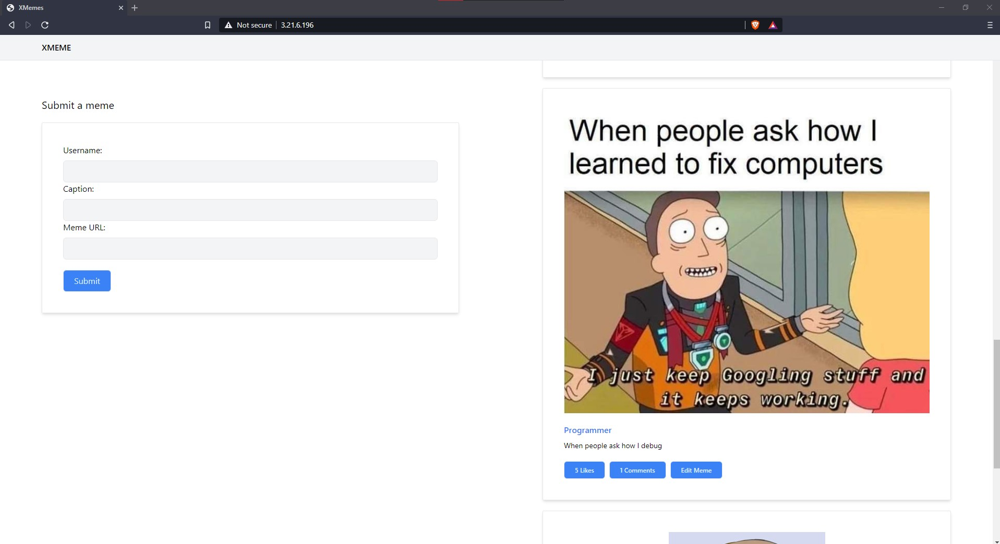

## XMeme

A **Meme streaming application** where users can post memes by providing their name, a caption for the meme and the URL for the meme image as input. The Timeline will display the latest 100 posted Memes.

## Tech Stack used

| |Environment | Framework
------------ |------------ | -------------
Frontend | Node.js v14.15.5 | React v17.0.1
Backend | Python 3.8.7 | Django 3.1.6

## Getting Started

Run install.sh to install the requirements and pre-requisites.

```console
foo@bar:~$ sudo apt-get update

foo@bar:~$ sudo apt-get install -y python3    
foo@bar:~$ sudo apt-get install -y python3-pip

foo@bar:~$ pip3 install -r ./requirements.txt  
```

Run server_run.sh to configure the database and start the server.

```console
foo@bar:~$ python3 ./manage.py makemigrations        
foo@bar:~$ python3 ./manage.py migrate

foo@bar:~$ python3 ./manage.py runserver 0.0.0.0:8081

```

## User Interface Demo


